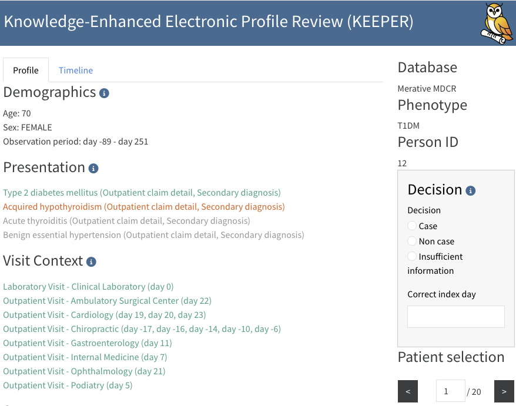

```{r, echo = FALSE, message = FALSE, warning = FALSE}
library(Keeper)
```

# Introduction

This vignette describes how to use Keeper to generate patient summaries for case adjudication from data mapped to the OMOP Common Data Model (CDM).

Keeper extracts and summarizes patient-level data for individuals in a specified cohort to facilitate the review of patient profiles. Such examinations can be used to interactively develop a phenotype (cohort definition) of a disease or—in its primary use case—to determine if patients truly have the disease and subsequently calculate positive predictive value (PPV). 

This review should be conducted by someone familiar with the disease of interest, the underlying data, and the data collection process. Alternatively, the review can be performed by large language models (LLMs), which additionally enables the calculation of sensitivity and specificity. Please refer to the *Using Keeper with LLMs* vignette for more details on that use case.

# Clinical Definition

The first step is to write a [clinical definition](https://ohdsi.github.io/PhenotypeLibrary/articles/GuidanceOnClinicalDescriptionForConditionPhenotypes.html). For this exercise, we will use a brief version, using Type 1 Diabetes Mellitus (T1DM) as our example phenotype.

> [T1DM](https://www.ncbi.nlm.nih.gov/books/NBK507713/) is an autoimmune condition characterized by decreased insulin production by the pancreas. Onset most commonly occurs in childhood or adolescence, but it can present in adults. Symptoms include weight loss, polyuria, polydipsia, fatigue, and others. Common differential diagnoses (conditions that must be ruled out) include type 2 diabetes, pancreatic disorders such as cystic fibrosis, pancreatic necrosis, steroid-induced diabetes, renal glycosuria, and other conditions. Diagnostic procedures include glucose measurements, C-peptide, pancreatic and insulin antibodies, as well as HbA1c testing. It is primarily treated with insulin. Complications can include hypo- and hyperglycemia, neuropathy, nephropathy, cerebrovascular disease, and peripheral artery disease. 

We will use this definition to construct our inputs. The concept of differential diagnosis is crucial; for each input category (except the disease of interest itself), we will consider concepts related to both T1DM and its differential diagnoses to evaluate evidence for the disease and to effectively rule out alternatives.

# Creating Input Concept Sets

Keeper extracts data based on user-defined concept sets. If a concept belonging to an input concept set is found in a patient's records, Keeper will extract it along with its date relative to the index date. Therefore, careful concept set selection is highly important. 

These input concept sets can be created manually, but this process can be challenging and labor-intensive. Alternatively, we can use large language models (LLMs) to generate initial concept sets.

## Using LLMs to Generate Concept Sets

We use the `ellmer` package to connect to an LLM from your provider of choice, including Anthropic, Google, OpenAI, or a local LLM. For example, we can connect to OpenAI's ChatGPT using:

```{r eval = FALSE}
library(ellmer)
client <- chat_openai()
```

This assumes you have set the `OPENAI_API_KEY` environmental variable. See the [ellmer package](https://ellmer.tidyverse.org) for details on connecting to various providers.

We also need access to a database containing the OHDSI Vocabulary tables. We specify the connection details like so:

```{r eval = FALSE}
library(DatabaseConnector)
connectionDetails <- createConnectionDetails(
  dbms = "postgresql",
  server = "localhost/ohdsi",
  user = "joe",
  password = "supersecret"
)
vocabularyDatabaseSchema <- "cdm"
```

See the [`createConnectionDetails()`](https://ohdsi.github.io/DatabaseConnector/reference/createConnectionDetails.html) documentation for more information on connecting to your database server.

Next, we can generate the concept sets:

```{r eval = FALSE}
conceptSets <- generateKeeperConceptSets(
  phenotype = "Type I Diabetes Mellitus (T1DM)",
  client = client,
  vocabConnectionDetails = connectionDetails,
  vocabDatabaseSchema = vocabDatabaseSchema
)
conceptSets
```
```{r eval=TRUE, echo=FALSE, message=FALSE}
conceptSets <- read.csv(system.file("t1dmConceptSets.csv", package = "Keeper"))
conceptSets <- dplyr::as_tibble(conceptSets)
conceptSets
```

## Manual Creation or Review of Concept Sets

We can also create the concept sets manually, or, if we used an LLM to generate them, review the outputs. The format of the concept sets should be a data frame with the following columns:

* **`conceptId`**: The specific concept ID.
* **`conceptName`**: The name of the concept.
* **`vocabularyId`**: The vocabulary the concept belongs to.
* **`conceptSetName`**: The category of the concept set. Allowed values are: `"doi"`, `"alternativeDiagnosis"`, `"symptoms"`, `"drugs"`, `"diagnosticProcedures"`, `"measurements"`, `"treatmentProcedures"`, `"complications"`.
* **`target`**: Either `"doi"` or `"alternativeDiagnosis"`, depending on which condition the concept is related to. This distinction only matters for color-coding within the Shiny app.

Importantly, when using `useDescendants = TRUE` in `generateKeeper()` (which is the default setting), all descendants of the concepts specified here will automatically be included.

Below, we discuss each concept set category in detail.

### DOI

DOI (Disease of Interest) is the target condition being evaluated. Here, we select two concepts along with their descendants:

* 201254 Type 1 diabetes mellitus
* 435216 Disorder due to type 1 diabetes mellitus

The first code represents T1DM itself, while the second code denotes diseases occurring due to T1DM, which implies the patient also has T1DM. A common strategy is to select the codes used as index event criteria in the phenotype definition. If `useAncestor` is set to `TRUE` (the default behavior), Keeper will use the hierarchy to pull in descendants of the selected concepts.

The DOI is looked up in the `CONDITION_OCCURRENCE` table.

### Alternative Diagnosis

Alternative diagnoses are the competing conditions we want to rule out. Differential diagnoses for T1DM include the following conditions:

* 201826 Type 2 diabetes mellitus
* 4192640 Pancreatitis
* 4163735 Hemochromatosis  
* 193170 Renal glycosuria
* ...

Alternative diagnosis codes are looked up in the `CONDITION_OCCURRENCE` table within 90 days before and after the index date.

**Note:** For all subsequent categories, we want to select the concepts relevant to the DOI *as well as those relevant to the alternative (competing/differential) diagnoses*. 

### Symptoms

Here we input symptoms typically occurring in T1DM and its differential diagnoses. These are signs and symptoms that occur in a short time window before disease onset.

Based on our clinical definition, we selected the following codes:

* 79936 Polyuria
* 432454 Excessive thirst
* 315078 Palpitations
* 439141 Abnormal weight gain    
* 4134010 Weight decreased
* ...

These are broad SNOMED codes representing the symptoms we are interested in; source codes of the corresponding conditions map either to them directly or to their descendants. 

A good approach for selecting codes for this section (and subsequent sections) is to input your term in ATLAS Search and click on the green shopping cart (the Phoebe initial code selection feature) to get a starting point. Then, use Phoebe (the Recommend tab within the ATLAS Concept Set module) to explore related recommendations. Instructions on how to use Phoebe can be found [here](https://www.ohdsi.org/2022showcase-6/). While you can explore your local data to find appropriate SNOMED codes using string searches, you are more likely to miss relevant codes this way.

Symptoms are looked up in the `OBSERVATION` and `CONDITION_OCCURRENCE` tables within the 30 days prior to the index date.

### Drugs

We selected drugs (ancestor terms with their descendants) used to treat T1DM as well as the differential diagnoses:

* 1596977 insulin, regular, human 
* 1502905 insulin glargine  
* 503297 metformin 
* 793143 semaglutide 
* ...

Drugs are looked up in the `DRUG_ERA` table any time prior to and any time after the index date (displayed as two separate columns).

### Diagnostic Procedures

Diagnostic procedures are the procedure codes used for diagnosing the disease of interest or alternative disease(s). 

* 4083913 Urine specimen collection, 24 hours
* 4300757 Computed tomography
* ...

Diagnostic procedures are looked up in the `PROCEDURE_OCCURRENCE` table within 30 days prior to and after the index date.

### Measurements

Measurements are laboratory tests used to diagnose T1DM and differential diagnoses:

* 4215993 Administration of insulin
* 3004410 Hemoglobin A1c/Hemoglobin.total in Blood
* 3007263 Hemoglobin A1c/Hemoglobin.total in Blood by calculation
* 40762352 Hemoglobin A1c/Hemoglobin.total in Blood by IFCC protocol
* 4073199 Total thyroidectomy
* ...

Note that there are often many variants of a given measurement. Be sure to include them all.

Measurements are looked up in the `MEASUREMENT` table within 30 days prior to and after the index date.

### Treatment Procedures

Treatment procedures correspond to the treatment of the disease of interest or alternative disease(s). In this case, most procedures correspond to alternative diagnoses:

* 4215993 Administration of insulin   
* 2000307 Unilateral adrenalectomy 
* 4073199 Total thyroidectomy 

Treatment procedures are looked up in the `PROCEDURE_OCCURRENCE` table any time after the index date.

### Complications

Complications are other conditions occurring as a result of the disease. We selected the following codes along with their descendants:

* 24609 Hypoglycemia
* 4301699 Neuropathy
* 4262920 Skin ulcer
* 435517 Acidosis
* 4340390 Chronic hepatic failure
* ...

Complications are looked up in the `CONDITION_OCCURRENCE` table any time before or after the index date (displayed as two separate columns).

# Creating the Cohort to Evaluate

Keeper creates profiles of persons in a specified cohort. Cohorts can be created using ATLAS, R, or SQL. The cohort table must contain the following fields:

* **`cohort_definition_id`** (INT): A unique identifier per cohort.
* **`subject_id`** (BIGINT): A unique identifier per person. This should correspond to the person ID in the CDM data.
* **`cohort_start_date`** (DATE): The date the person enters the cohort.
* **`cohort_end_date`** (DATE): (Optional) The date the person exits the cohort.

More information on creating cohorts can be found [here](https://ohdsi.github.io/TheBookOfOhdsi/Cohorts.html).

When using LLMs, it is also possible to create a highly sensitive cohort—a cohort that is unlikely to miss any true cases. Please refer to the *Using Keeper with LLMs* vignette for instructions on creating highly sensitive cohorts.

# Running Keeper

With a cohort and input concept sets defined, we are ready to run Keeper. First, we need to specify how to connect to the server holding the cohort table and the CDM data:

```{r eval = FALSE}
connectionDetails <- createConnectionDetails(
  dbms = "postgresql",
  server = "localhost/ohdsi",
  user = "joe",
  password = "supersecret"
)
cdmDatabaseSchema <- "cdm"
cohortDatabaseSchema <- "cdm"
cohortTable <- "cohort"
cohortDefinitionId <- 1
```

This specifies that our cohort is located in the `cohort` table within the `cdm` database schema, and our cohort of interest has a `cohort_definition_id` of 1.

We generate the Keeper profiles using the following code:

```{r eval = FALSE}
keeper <- generateKeeper(
  connection = connection,
  cohortDatabaseSchema = cohortDatabaseSchema,
  cdmDatabaseSchema = cdmDatabaseSchema,
  cohortTable = cohortTable,
  cohortDefinitionId = cohortDefinitionId,
  sampleSize = 20,
  keeperConceptSets = conceptSets,
  phenotypeName = "T1DM",
  removePersonId = TRUE
)
```
```{r echo=FALSE,message=FALSE,eval=TRUE}
keeper <- readRDS(system.file("shuffledKeeper.rds", package = "Keeper"))
```

Here, `conceptSets` is the data frame we created earlier holding the target concepts. We specify a `sampleSize` of 20, meaning Keeper will randomly select up to 20 persons from the cohort. Alternatively, we could have provided a specific set of person IDs for Keeper to restrict its query to. 

We provide a `phenotypeName` strictly for administrative purposes. We also set `removePersonId = TRUE` so that the output will not contain the original person IDs, ensuring the output is completely anonymized with no personally identifying information (PII).

## Keeper Output

Keeper will populate the following categories with concepts observed in the person's records:

* **Patient ID:** (Optional, if `removePersonId = FALSE`).
* **Demographics:** Age, gender, race, and ethnicity.
* **Visit context:** Information about visits occurring in the window from 30 days prior to 30 days after the index date.
* **Observation period:** Information about overlapping `OBSERVATION_PERIOD` records, formatted as *days prior* to *days after* the index date.
* **Presentation:** All records in `CONDITION_OCCURRENCE` on day 0, along with their corresponding type and status.
* **Symptoms:** Records in `CONDITION_ERA` selected as symptoms within the 30 days prior to the index date, excluding day 0. This list does not include the disease of interest or complications. (If you want to track symptoms outside of this window, please place those codes in the complications concept set).
* **Prior disease:** Records in `CONDITION_ERA` selected as the disease of interest or complications at any time prior to the index date, excluding day 0.
* **Prior drugs:** Records in `DRUG_ERA` selected as drugs of interest at any time prior to the index date, excluding day 0, formatted as the day the era starts and the length of the drug era.
* **Prior treatment procedures:** Records in `PROCEDURE_OCCURRENCE` selected as treatments of interest at any time prior to the index date, excluding day 0.
* **Diagnostic procedures:** Records in `PROCEDURE_OCCURRENCE` selected as diagnostic procedures at any time prior to the index date, excluding day 0.
* **Measurements:** Records in `MEASUREMENT` selected as lab tests of interest within 30 days before and 30 days after day 0. These are formatted as value and unit (if available) and assessed against the reference range provided in the `MEASUREMENT` table (e.g., normal, abnormal high, abnormal low).
* **Alternative diagnosis:** Records in `CONDITION_ERA` selected as competing diagnoses within 90 days before and 90 days after day 0. This list does not include the disease of interest.
* **Post disease:** Same as prior disease, but occurring after day 0.
* **Post drugs:** Same as prior drugs, but occurring after day 0.
* **Post treatment procedures:** Same as prior treatment procedures, but occurring after day 0.
* **Death:** Any death record occurring after day 0.

# Reviewing the Keeper Profiles

We can review the Keeper profiles manually or use an LLM, as described in the *Using Keeper with LLMs* vignette. When reviewing profiles manually, we can choose to do this in a spreadsheet program like Microsoft Excel or by using the built-in Shiny app.

## Review in a Spreadsheet

We can convert the output of `generateKeeper` into a data frame having one row per person, with one column for each of the Keeper output categories:

```{r}
keeperTable <- convertKeeperToTable(keeper)
keeperTable
```

We can then save this table to a CSV file and open it in Excel:

```{r eval = FALSE}
readr::write_csv(keeperTable, "e:/temp/KeeperT1dm.csv")
```

## Review Using the Shiny App

Alternatively, we can launch the built-in Shiny app to review the profiles interactively:

```{r eval = FALSE}
launchReviewerApp(
  keeper = keeper,
  keeperConceptSets = conceptSets,
  decisionsFileName = "decisions.csv"
)
```

This will launch the Shiny application, which looks like this: 



Any decisions you log within the app will be written to the specified decisions file (e.g., `decisions.csv`). If the decisions file does not yet exist, Keeper will create it for you.
