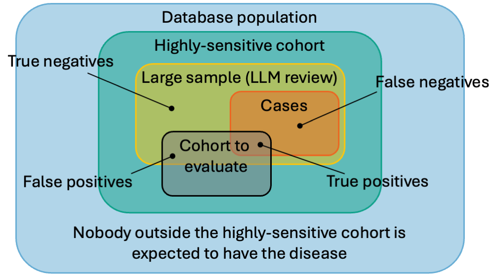

```{r, echo = FALSE, message = FALSE, warning = FALSE}
library(Keeper)
```

# Introduction

This vignette demonstrates how to use **Keeper** to generate patient summaries and systematically review them using a Large Language Model (LLM). 

**Prerequisites:**
Before proceeding, ensure you have read the *'Generating Keeper profiles for review'* vignette. We will build directly on the Type 1 Diabetes Mellitus (T1DM) example established there, assuming you have already created the necessary objects and input concept sets.

---

# Workflow 1: Direct Cohort Review

In this first workflow, we will take an existing cohort, generate Keeper profiles, and use an LLM to evaluate those specific cases. We assume that Keeper has already been executed to produce the following output:

```{r echo=FALSE,message=FALSE,eval=TRUE}
keeper <- readRDS(system.file("shuffledKeeper.rds", package = "Keeper"))
```
```{r}
keeper
```

## 1. Choosing an LLM Provider

Keeper integrates with the `ellmer` package, allowing you to connect to the LLM provider of your choice (e.g., Anthropic, Google, OpenAI, or a local model). 

For instance, to connect to OpenAI's ChatGPT, you can use:

```{r eval = FALSE}
library(ellmer)
client <- chat_openai()
```

*Note:* This requires the `OPENAI_API_KEY` environmental variable to be set. For detailed connection instructions across various providers, refer to the [ellmer package documentation](https://ellmer.tidyverse.org). 

**Model Requirements:** The selected LLM must be capable of advanced reasoning and producing structured outputs. In our testing, OpenAI's GPT-o3 yielded the best results.

## 2. Executing the Review

Once connected, we can command the LLM to review the patient cases:

```{r eval = FALSE}
promptSettings <- createPromptSettings()
llmReviews <- reviewCases(
  keeper = keeper,
  settings = promptSettings,
  phenotypeName = "Type I Diabetes Mellitus (T1DM)",
  client = client,
  cacheFolder = "cache"
)
```
```{r echo=FALSE,eval=TRUE}
message("Reviewing person 1 of 20\n...\nReviewing person 20 of 20\nReviewing cases took 3.9 mins and cost $0.50")
```

**Key Parameters:**
* `phenotypeName`: This string is inserted directly into the LLM prompt. It must exactly match the disease you are adjudicating.
* `cacheFolder`: A local directory where prompts and responses are safely cached. If the process is interrupted, re-running the function will skip previously generated responses.

We can inspect the resulting adjudications:

```{r echo=FALSE,message=FALSE,eval=TRUE}
llmReviews <- readRDS(system.file("llmReviews.rds", package = "Keeper"))
```
```{r}
llmReviews
```

With this data, computing the positive predictive value (PPV) of the reviewed cohort is straightforward:

```{r}
mean(llmReviews$isCase == "yes")
```

---

# Workflow 2: Validating with a Reference Cohort

Instead of analyzing an existing cohort just to find its PPV, we can build a **Highly-Sensitive Cohort (HSC)**. An HSC is designed to be overly broad, ensuring no true cases are missed. 

By taking a large sample of this HSC and having an LLM review it, we create a gold-standard **Reference Cohort**. This reference cohort can then be used to rapidly evaluate the PPV *and* sensitivity of any other cohort definitions for the same phenotype.

{width=350px}

## 1. Creating the Highly-Sensitive Cohort

The `createSensitiveCohort()` function automatically constructs this broad cohort using the same input concept sets utilized by `generateKeeper()`.

The cohort is constructed by combining two sets:

1. Anybody who has one of the condition concepts of the disease of interest, indexed on the first occurrence.
 
2. Anybody who has 'highly specific concepts' from at least two Keeper categories (symptoms, drugs, etc.), indexed on the first occurrence.
 
Highly specific concepts are concepts where at least 10% of those who have that concept also have a condition concept for the disease of interest. 

```{r eval = FALSE}
createSensitiveCohort(
  connectionDetails = connectionDetails,
  cdmDatabaseSchema = cdmDatabaseSchema,
  cohortDatabaseSchema = cohortDatabaseSchema,
  cohortTable = cohortTable,
  cohortDefinitionId = 2,
  createCohortTable = FALSE,
  keeperConceptSets = conceptSets
)
```

Here, we assign `cohortDefinitionId = 2` to prevent overwriting the simpler cohort (ID 1) we created in the previous vignette.

## 2. Running Keeper on the HSC

Next, we extract the patient profiles for our new sensitive cohort:

```{r eval = FALSE}
keeperHsc <- generateKeeper(
  connectionDetails = connectionDetails,
  cohortDatabaseSchema = cohortDatabaseSchema,
  cdmDatabaseSchema = cdmDatabaseSchema,
  cohortTable = cohortTable,
  cohortDefinitionId = 2,
  sampleSize = 10000,
  phenotypeName = "Type I Diabetes Mellitus (T1DM)",
  keeperConceptSets = conceptSets,
  removePii = FALSE
)
```

**Important considerations:**
* **Sample Size:** We sample 10,000 persons to guarantee enough true positive cases for robust PPV and sensitivity calculations.
* **PII Handling:** We set `removePii = FALSE` so that the resulting LLM adjudications can be joined accurately with specific target cohorts later during evaluation.

## 3. Adjudicating the HSC via LLM

We now send all 10,000 sampled profiles to the LLM for review. 

> **Cost Warning:** Adjudicating a dataset of this size can incur significant API costs. For example, using our preferred model (GPT-o3) to review 10,000 cases typically costs between $60 and $80.

```{r eval = FALSE}
promptSettings <- createPromptSettings()
llmReviewsHsc <- reviewCases(
  keeper = keeperHsc,
  settings = promptSettings,
  client = client,
  cacheFolder = "cacheVignetteHsc"
)
```

Once complete, this dataset becomes our *Reference Cohort*.

## 4. Storing the Reference Cohort

To use the reference cohort across different analyses, we upload it back to our database server:

```{r eval = FALSE}
referenceCohortDatabaseSchema <- "cdm"
referenceCohortTable <- "reference_cohort"

uploadReferenceCohort(
  connectionDetails = connectionDetails,
  referenceCohortDatabaseSchema = referenceCohortDatabaseSchema,
  referenceCohortTableNames = createReferenceCohortTableNames(referenceCohortTable),
  referenceCohortDefinitionId = 1,
  createReferenceCohortTables = TRUE,
  reviews = llmReviewsHsc
)
```

Setting `createReferenceCohortTables = TRUE` generates two tables (`reference_cohort` and `reference_cohort_metadata`). We also assign a `referenceCohortDefinitionId` of `1` to uniquely identify it for future comparisons.

## 5. Evaluating Target Cohorts

With our reference cohort safely stored in the database, evaluating any standard T1DM cohort is highly efficient. Let's evaluate the simple target cohort (`cohortDefinitionId = 1`) from the previous vignette:

```{r eval = FALSE}
metrics <- computeCohortOperatingCharacteristics(
  connectionDetails = connectionDetails,
  cohortDatabaseSchema = cohortDatabaseSchema,
  cohortTable = cohortTable,
  cohortDefinitionId = 1,
  referenceCohortDatabaseSchema = referenceCohortDatabaseSchema,
  referenceCohortTableNames = createReferenceCohortTableNames(referenceCohortTable),
  referenceCohortDefinitionId = 1
)
```

Finally, we can view the computed performance metrics (such as sensitivity, specificity, and PPV) for our target cohort:

```{r echo=FALSE,message=FALSE,eval=TRUE}
# metrics <- readRDS(system.file("metrics.rds", package = "Keeper"))
```
```{r}
# metrics
```
